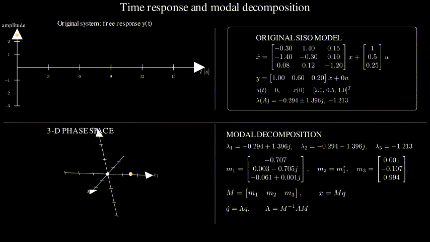

# Control II — Modal Decomposition with Manim

An educational Manim animation illustrating modal decomposition in a three-dimensional linear system. The scene shows individual modal contributions and their reconstruction into the complete state response.

This repository accompanies the **Control II** course taught by Juan Sebastián Gómez at Universidad Andrés Bello.

## Preview



## Mathematical idea

For a diagonalizable linear system

```text
x_dot = A x,
```

the free response can be expressed as a sum of modal contributions:

```text
x(t) = Σ v_i c_i exp(λ_i t),
```

where `λ_i` and `v_i` are the eigenvalues and eigenvectors of `A`, and the coefficients `c_i` depend on the initial condition.

## Render locally

With Docker installed, run:

```bash
docker run --rm -v "${PWD}:/manim" manimcommunity/manim:v0.20.1 \
  manim -ql modal_decomposition.py ModalDecomposition3DSnapshot
```

To render the GIF:

```bash
docker run --rm -v "${PWD}:/manim" manimcommunity/manim:v0.20.1 \
  manim -ql --format=gif modal_decomposition.py ModalDecomposition3DSnapshot
```

## Contents

- `modal_decomposition.py`: reproducible Manim scene.
- `assets/modal-decomposition.gif`: rendered preview.
- `LICENSE`: MIT License.

## Course

[Control II teaching page](https://jgomez-unab.github.io/teaching.html#control-two)

## License

Released under the MIT License. See `LICENSE`.
